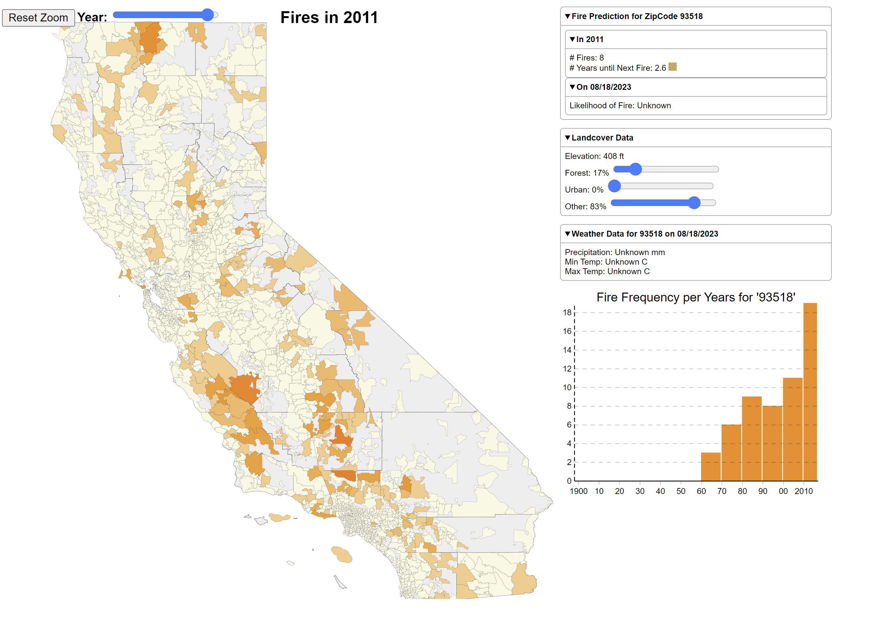

## Firerisk UI



## Prerequisite Dependancies
###### Thank goodness for ASDF

https://asdf-vm.com/guide/getting-started.html#_2-download-asdf

1) nodejs

- asdf plugin add nodejs https://github.com/asdf-vm/asdf-nodejs.git
- asdf install nodejs latest
- asdf global nodejs latest

2) npm (comes with nodejs installation)

3) python (installed with conda?)

4) pip


## Dependancy Installation

terminal 1:
```
./0_install_dependancies.sh
./1_run_backend_server.sh
```

terminal 2:
```
./2_run_frontend_server.sh
```

## To Run

by this point a tab should have opened in your browser. if not, try : `127.0.0.1:8080`

- start backend prediction server:
    > 1_run_backend_server.sh
- start frontend interface server:
    > 2_run_frontend_server.sh

## Firerisk UI
- Default year selected is 2017
- Can pan/zoom map of California
- Can Select zipcode-boundary:
  + exposes details on right hand side
  + can adjust sliders to experiment with 
    different landcover% and see result
  + can view weather information
  + can view #years and %prob-fire predictions
  + can view histogram of fire occurances
    throughout the years for the selected zipcode

## Final Product data backing this
./assembled-data

## Raw data not included, too big, find GIS codes
./data-processing/*

